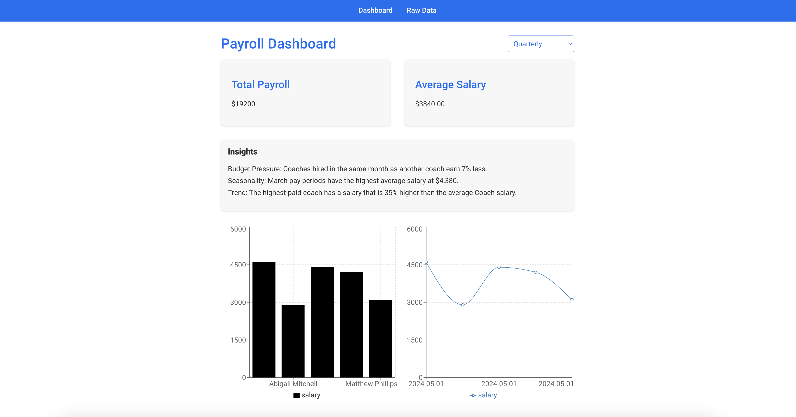
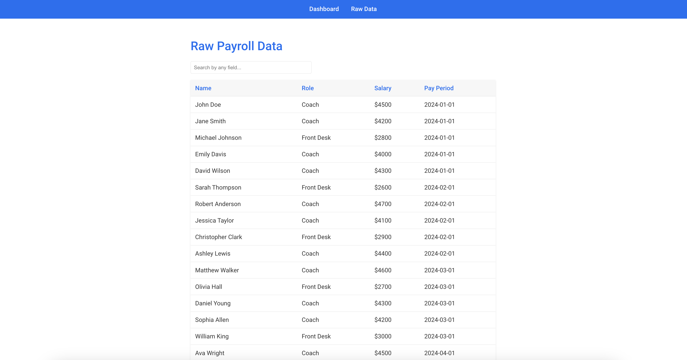

# Payroll Dashboard Application

This project is a React-based Payroll Dashboard that visualizes payroll data through interactive charts using Recharts.

<p align="center">
  
  
</p>

## Prerequisites

Before you begin, ensure you have met the following requirements:

* You have installed Node.js and npm. Download them from [Node.js website](https://nodejs.org/).

## Installing Payroll Dashboard

To install the Payroll Dashboard, follow these steps:

1. Clone the repository:
   ```bash
   git clone https://github.com/arjshah/payroll-dashboard.git
   cd payroll-dashboard

2. Install dependencies:
   ```bash
    npm install
  
3. Install Recharts:
   ```bash
    npm install recharts

## Using Payroll Dashboard
To use the Payroll Dashboard, follow these steps:

  Start the development server:
   ```bash
    npm start
